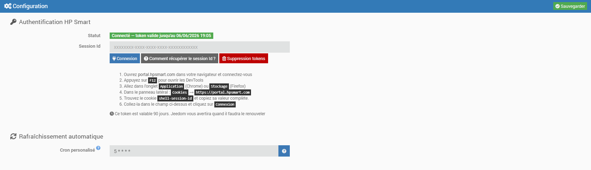
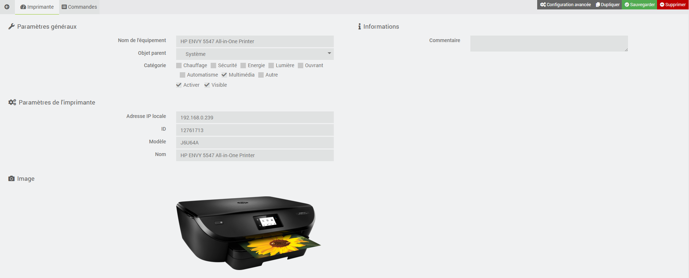
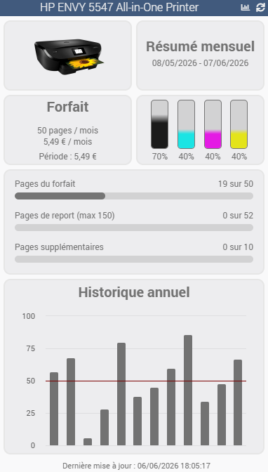

# Overview

This plugin allows you to retrieve information about your InstantInk subscription and your HP printers.

> **Tip**
>
> The **minimum version of Jeedom** required for the plugin to work properly is **version 4.4**
>
> The plugin is compatible with **Debian versions 11 & 12**

# Installation

The plugin installs just like any other plugin on Jeedom, via the Market.

# Setup

1. Once installed and activated, on the configuration page, you must enter a **sessionId** token
2. Open [portal.hpsmart.com](https://portal.hpsmart.com) in your browser and log in
3. Press **F12** to open DevTools
4. Go to the **Applications** tab (Chrome) or **Storage** tab (Firefox)
5. In the sidebar: **Cookies → https://portal.hpsmart.com**
6. Find the **shell-session-id** cookie and copy its entire value
7. Paste it into the corresponding field and click **Log In**

This token is valid for 90 days. Jeedom will notify you when it needs to be manually renewed.

8. If you have connection issues, you can delete the tokens you previously retrieved by clicking the **Delete tokens** button
9. Enter the plugin's optional settings:
    - Custom Cron job (recommended value: at least 1 hour)
10. Back up

> **Tip**
>
> To make it easier to request remote assistance, we recommend setting the logs to **debug mode**.

# Usage

1. Launch the plugin located in the **Connected Devices** category of the **Plugins** menu
2. Click the **Synchronize** button
3. Your printer appears in the list
4. Click on your printer's icon and enter its IP address in the field provided
5. Back up

# Commands

There are currently several commands, which are described below.

## Info

| Command | Description |
|---|---|
| **Number of plan pages** | the number of pages included in your plan |
| **Maximum number of pages to carry forward** | the maximum number of pages carried forward from one period to the next |
| **Plan Price** | the monthly price of your plan |
| **Maximum number of additional pages per plan** | the maximum number of pages allowed in mode not on a plan |
| **Period** | the current billing period |
| **Number of pages printed during the period** | the number of pages printed during the period |
| **Number of printed pages for the reporting period** | the number of printed pages reported for the period |
| **Maximum number of pages carried forward for the period** | the number of pages carried forward over the period |
| **Number of additional pages printed during the period** | the number of pages printed beyond the plan allowance during the period |
| **Period Price** | the current price for the period |
| **Black Cartridge Status** | current ink level of the black cartridge (%) |
| **Cyan Cartridge Status** | current ink level of the cyan cartridge (%) |
| **Magenta Cartridge Status** | Current ink level of the magenta cartridge (%) |
| **Yellow Cartridge Status** | current ink level of the yellow cartridge (%) |
| **Last Updated** | the date and time the information was last updated |
| **History** | All plan information (printed pages and prices) for the last 12 months |

> **Tip**
>
> If you do not want to display the history on the widget, simply uncheck the **Show** box for this command.

## Action

| Command | Description |
|---|---|
| **Refresh** | updates all printer and plan information |
| **View History** | allows you to view your plan history for the last 12 months |

# Dashboard

The plugin includes a custom widget that displays all the information about the plan and the printer.

You can refresh the information (icon <svg width="15" height="15" viewBox="0 0 24 24" fill="none" stroke="currentColor" stroke-width="2" stroke-linecap="round" stroke-linejoin="round" style="vertical-align:-2px"><path d="M21 12a9 9 0 1 1-2.64-6.36"/><path d="M21 3v6h-6"/></svg>) or the history (icon <svg width="15" height="15" viewBox="0 0 24 24" fill="none" stroke="currentColor" stroke-width="2" stroke-linecap="round" stroke-linejoin="round" style="vertical-align:-2px"><path d="M3 3v18h18"/><path d="M7 16v2M12 11v7M17 7v11"/></svg>) directly from the widget.

# Refresh

## Automatic

As indicated on the plugin's configuration page:

- A **daily CRON job** is automatically created every day (at 12:00 a.m.) to update the plan history
- A **custom CRON job** is automatically created to retrieve plan and printer information (a minimum of 1 hour is recommended)

## Manual

You can use the **Refresh** or **Get History** commands at any time to update the plan and printer information.

# Roadmap & Support

This plugin will evolve over time based on your requests and the capabilities of the instantInk APIs.

The following features will be included in upcoming versions:

- ...

> **Tip**
>
> You can submit a feature request by creating an "enhancement" issue on [GitHub](https://github.com/Xav-74/instantInk/issues/new).
>
> Feel free to join the discussion about this plugin on the Jeedom Community!

If a problem occurs, you can create a thread directly in the Community from the plugin’s main page. Relevant information from Jeedom and the plugin is automatically included. Feel free to copy the instantInk logs (debug mode) as well for faster troubleshooting!

