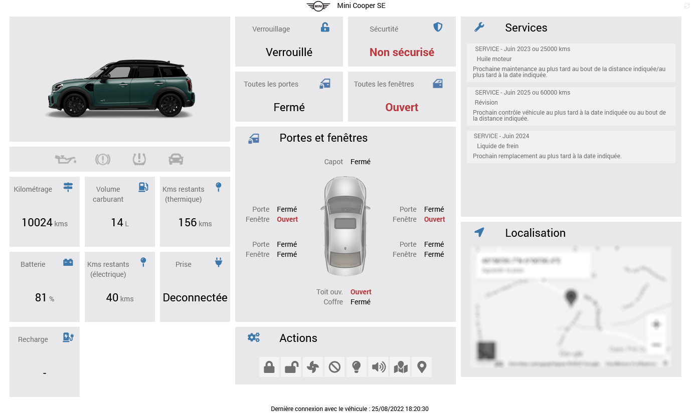

# Présentation 

Ce plugin vous permet d'interagir avec votre voiture BMW ou Mini équipée des services Connected Drive, au même titre que l’application officielle “My BMW” ou "Mini".

# Principe 

Ce plugin interagit avec les API BMW Connected Drive au travers du cloud, par conséquent **ce plugin nécessite une connexion Internet**.
 
Il faut également détenir un abonnement en cours de validité aux services BMW Connected Drive pour votre véhicule ainsi qu'un compte utilisateur valide pour l'application "My BMW" ou "Mini".

# Configuration du plugin

Après téléchargement du plugin, il vous suffit juste d’activer celui-ci, il n’y a aucune configuration supplémentaire à ce niveau.

> **Tip**
>
> Pour faciliter une demande d'aide à distance, il est conseillé de régler les logs en **mode debug**. 

# Ajout d'un véhicule

La configuration des équipements MyBMW est accessible à partir du menu Plugin > Objets connectés.

Cliquez sur la commande Ajouter pour créer un nouveau véhicule. Une fois ajouté vous vous retrouvez avec :

-   **Nom de l’équipement** : nom de votre véhicule

-   **Objet parent** : indique l’objet parent auquel appartient l’équipement

-   **Catégorie** : la catégorie de l’équipement

-   **Activer** : permet de rendre votre équipement actif

-   **Visible** : rend votre équipement visible sur le dashboard

-   **Identifiant** : indiquez votre identifiant My BMW que vous utilisez pour vous connecter sur l'application "My BMW" ou "Mini"

-   **Mot de passe** : indiquez votre mot de passe

-   **Marque** : indiquez la marque de votre véhicule (BMW ou Mini)

-   **VIN** : indiquez le numéro VIN ou Vehicle Identification Number (Numéro d’identification du véhicule). Vous pouvez retrouver ce numéro en case E de votre carte grise. Ce numéro est composé de 17 caractères.

-   **Widget personnalisé** : sélectionnez le widget personnalisé du plugin à afficher sur le dashboard (flat design ou legacy). Si vous choisissez "Aucun", vous obtiendrez une tuile brute avec l'ensemble des commandes.

-   **Domicile (présence)** : vous disposez de 3 possibilités pour indiquer les coordonnées GPS de votre domicile : soit en utilisant les coordonnées renseignées dans Jeedom, soit en utilisant les coordonnées actuelles du véhicule, soit en renseignant manuellement la latitude et la longitude. N'oubliez ensuite de renseigner la distance maximale entre votre domicile et le véhicule pour la gestion de la présence. 

Il vous suffit ensuite de cliquer sur le bouton **Synchroniser** pour récupérer les informations de votre véhicule. Si celles-ci sont disponibles, vous obtiendrez le modèle, l'année, le type de motorisation ainsi qu'une image de votre véhicule.

> **Tip**
>
> N'oubliez pas de **sauvegarder** vos informations !
>
> Lors de la sauvegarde, de nouvelles commandes vont se créer sur l'équipement.

# Données brutes

Pour faciliter le debug en cas de problème, vous avez la possibilité de récupérer les données brutes de votre véhicule en cliquant sur le bouton **Données brutes**. Attention, avant de les copier sur le forum par exemple, pensez à masquer les informations sensibles comme le numéro de VIN par exemple !

# Commandes

Il existe actuellement plusieurs commandes qui sont décrites ci-dessous.

> **Tip**
>
>Si la commande renvoie "not available", c'est que l'information correspondante n'est pas présente sur votre véhicule.

## Info

-   **Marque**
-   **Modèle**
-   **Année**
-   **Type** : électrique, thermique ou hybride
-   **Kilométrage** : kilométrage total du véhicule
-   **Verrouillage** : remonte l'état de verrouillage du véhicule
-   **Statut porte conducteur avant**
-   **Statut porte conducteur arrière**
-   **Statut porte passager avant**
-   **Statut porte passager arrière**
-   **Statut toutes les portes**
-   **Statut fenêtre conducteur avant**
-   **Statut fenêtre conducteur arrière**
-   **Statut fenêtre passager avant**
-   **Statut fenêtre passager arrière**
-   **Statut toutes les fenêtres**
-   **Statut coffre**
-   **Statut capot moteur**
-   **Statut toit ouvrant**
-   **Pression pneu avant gauche**
-   **Consigne de gonflage pneu avant gauche**
-   **Pression pneu avant droit**
-   **Consigne de gonflage pneu avant droit**
-   **Pression pneu arrière gauche**
-   **Consigne de gonflage pneu arrière gauche**
-   **Pression pneu arrière droit**
-   **Consigne de gonflage pneu arrière droit**
-   **Etat de la charge** (uniquement sur véhicule électrique ou hybride)
-   **Etat de la prise** (uniquement sur véhicule électrique ou hybride)
-   **Charge restante** (uniquement sur véhicule électrique ou hybride)
-   **Km restant** (moteur électrique, hybride et/ou thermique)
-   **Carburant restant** (uniquement sur véhicule thermique ou hybride)
-   **Messages** : remonte les messages affichés dans le véhicule (contrôle et services)
-   **Coordonnées GPS** : remonte la position du véhicule sour la forme "latitude,longitude"
-   **Dernière mise à jour** : donne la date et l'heure de la dernière connexion entre la voiture et les serveurs BMW
-   **Statut Déverrouiller** : renvoie le dernier statut recu lors d'une demande de déverrouillage. Si l'action a correctement été effectuée, le statut passe à de "PENDING" à "EXECUTED". Sinon renvoie "ERROR"
-   **Statut Verrouiller**
-   **Statut Ventiler**
-   **Statut Stop Ventiler**
-   **Statut Appel de phares**
-   **Statut Klaxonner**
-   **Statut Rechercher**
-   **Statut Envoi POI**
-   **Présence domicile** : indique si votre véhicule est situé à votre domicile (1 = présent, 0 = absent) en fonction de la distance maximale renseignée
-   **Distance domicile** : indique la distance (en m ou km) entre le véhicule et votre domicile

## Action

-   **Rafraichir** : met à jour l'ensemble des informations du véhicule 

-   **Verrouiller** : permet de verrouiller la voiture à distance

-   **Déverrouiller** : permet de déverrouiller la voiture à distance

-   **Ventiler (Start)** : permet de démarrer le système de ventilation à la température réglée dans le véhicule

-   **Ventiler (Stop)** : permet de démarrer le système de ventilation à la température réglée dans le véhicule

-   **Appel de phares** : déclenche un appel de phare

-   **Klaxonner** : déclenche un avertissement sonore

-   **Rechercher** : localise le véhicule en temps réel et l'affiche sur une carte googlemaps

-   **Envoi POI** : envoi d'un point d'intérêt (POI) dans le centre de messages du véhicule en saisissant le nom, la latitude et la longitude du lieu

# Dashboard

Le plugin inclut 2 widgets personnalisés qui permettent d'afficher l'ensemble des informations du véhicule.

Pour ce dernier, vous pouvez le personnaliser en utilisant les paramètres optionnels suivants :
- all_info_display : show / hide → pour afficher / masquer les tuiles « Toutes les … ». Par défaut ou si vide = show
- doors_windows_display : text / icon → pour afficher l’états des portes sous forme de texte ou icones. Par défaut ou si vide = text
- color_icon_closed : green → pour afficher l’état des portes / fenêtres en couleur verte. Par défaut, ou si vide = white ou black en fonction du thème du core

# Rafraichissement

## Automatique

Un CRON est automatiquement créé sur base de 30 min comme indiqué dans la configuration du plugin.

**Attention** : cette valeur de 30 min pourra être amenée à évoluer en fonction du retour et des demandes des utilisateurs ainsi que du nombre de requêtes autorisées par BMW sur leurs serveurs !

## Manuel

Vous pouvez à tout moment utiliser la commande **Rafraichir** afin de rafraichir les statuts de véhicule.

# Roadmap

Ce plugin évoluera au fil du temps en fonction de vos demandes et des possibilités des API BMW Connected Drive.

Les prochaines versions verront arriver les features suivantes :

-   Ajout des fonctions de démarrage et d'arrêt de la charge des véhicules électriques de la marque
-   ...
-   Traduction du plugin en anglais

> **Tip**
>
>Vous pouvez faire votre demande d'amélioration en créant une issue "enhancement" sur [GitHub](https://github.com/Xav-74/myBMW/issues/new).
>
>N'hésitez pas non plus à venir échanger sur ce plugin sur le forum Jeedom !
