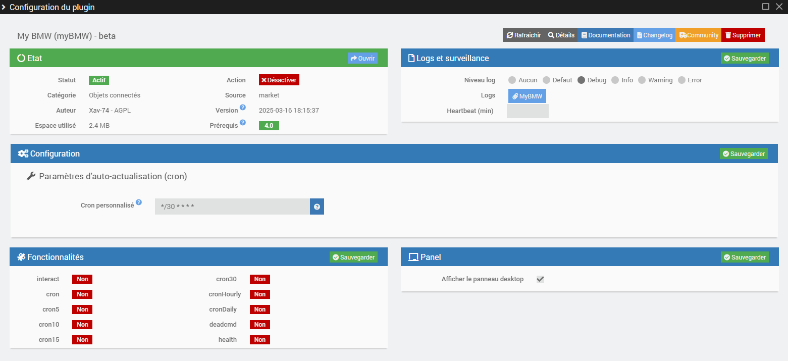

# Présentation 

Ce plugin vous permet d'interagir avec votre véhicule **BMW** ou **Mini** équipé des services Connected Drive, au même titre que l’application officielle “My BMW” ou "Mini".

> **Tip**
>
> La **version minimale de Jeedom** nécessaire au bon fonctionnement du plugin est la **version 4.2**
> Le plugin est d'ors et déjà compatible avec la **version 4.5** de Jeedom ainsi que les **versions Debian 11 & 12**


# Principe 

Ce plugin interagit avec les **API officielles BMW Connected Drive** au travers du cloud, par conséquent **ce plugin nécessite une connexion Internet**.
Il faut également détenir un abonnement en cours de validité aux services BMW Connected Drive pour votre véhicule ainsi qu'un compte utilisateur **principal** valide pour l'application "My BMW" ou "Mini".


# Configuration de votre compte utilisateur BMW ou Mini

Avant de pouvoir utiliser le plugin, vous devez configurez votre compte utilisateur BMW. Veuillez suivre scrupuleusement les étapes suivantes :

1. Connectez-vous sur le portail **[BMW ConnectedDrive](https://www.bmw.fr/fr-fr/mybmw/vehicle-overview)** ou **[Mini ConnectedDrive](https://www.mini.fr/fr-fr/mymini/vehicle-overview)**
3. Cliquez sur l'icône **BMW CarData** 


4. Cliquez sur le bouton **"Créer un client CarData"**
5. Copiez **l'ID client** en lieu sûr !
4. Attendez **30 secondes**
6. Cliquez sur **"Demander l'accès au CarData API"**
7. Attendez **30 secondes** (si le toggle ne repasse pas à "off" et que vous n'avez pas de message d'erreur, vous pouvez continuer, sinon vous devez recommencer cette étape)
8. Cliquez sur **"CarData Streaming"**
9. Attendez **30 secondes** (si le toggle ne repasse pas à "off" et que vous n'avez pas de message d'erreur, vous pouvez continuer, sinon vous devez recommencer cette étape)


10. Allez à la section **CarData Stream**
11. Vérifiez que l'état de la connexion est bien à **"ready"**


12. Cliquez sur le bouton **"Modifier la sélection des données"**
13. Sélectionnez **"Toutes les catégories"** (Vehicle Status, Charging, Trip Data, etc.) puis cliquez à plusieurs reprise sur le bouton **Charger** pour afficher tous les attributs
12. Sélectionnez **manuellement** les 244 attributs individuels ou appuyez sur F12 et entrez dans la **console développeur** et tapez : (pas de copié-collé possible)
```
document.querySelectorAll('label.chakra-checkbox:not([data-checked])').forEach(l => l.click());
```
14. Puis **sauvegardez** votre configuration
15. Copiez **le username** en lieu sûr !

**Il est important que tous les attributs soient cochés pour recevoir l'ensemble des données du véhicule.**


# Configuration du plugin

Après téléchargement du plugin, il vous suffit d’activer celui-ci, puis de configurer le client ID et le username récupérés dans l'étape précédente. Laissez les autres champs vides sauf demande express du développeur.
Attendez ensuite la fin de l'installation des dépendances et le démarrage du démon.

> **Tip**
>
> Pour faciliter une demande d'aide à distance, il est conseillé de régler les logs en **mode debug**. 




# Ajout d'un véhicule

La configuration des équipements MyBMW est accessible à partir du menu Plugin > Objets connectés.


Cliquez sur la commande Ajouter pour créer un nouveau véhicule. Une fois ajouté vous vous retrouvez avec :

-   **Nom de l’équipement** : nom de votre véhicule
-   **Objet parent** : indique l’objet parent auquel appartient l’équipement
-   **Catégorie** : la catégorie de l’équipement
-   **Activer** : permet de rendre votre équipement actif
-   **Visible** : rend votre équipement visible sur le dashboard
-   **Marque** : indiquez la marque de votre véhicule (BMW ou Mini)
-   **VIN** : indiquez le numéro VIN ou Vehicle Identification Number (Numéro d’identification du véhicule). Vous pouvez retrouver ce numéro en case E de votre carte grise. Ce numéro est composé de 17 caractères.
-   **Affichage état portes / fenêtres** : vous avez le choix entre 2 options pour l'affichage de l'état des portes et des fenêtres sur le panel : le mode texte ou le mode icône.
-   **Couleur des icônes portes / fenêtres** : si vous avez choisi le mode icône, vous pouvez également décider de la couleur des icônes (vert ou noir & blanc).
-   **Domicile (présence)** : vous disposez de 3 possibilités pour indiquer les coordonnées GPS de votre domicile : soit en utilisant les coordonnées renseignées dans Jeedom, soit en utilisant les coordonnées actuelles du véhicule, soit en renseignant manuellement la latitude et la longitude.
-   **Distance max (en m)** : indiquez la distance maximale en mètre entre votre domicile et le véhicule pour que celui-ci soit considéré comme présent à votre domicile. 

Il vous suffit ensuite de cliquer sur le bouton **Authentification** pour récupérer les informations de votre véhicule (Si celles-ci sont disponibles, vous obtiendrez le modèle, l'année, le type de motorisation ainsi qu'une image de votre véhicule). Une fenêtre pop-up s'ouvrira **(Attention au bloqueur de votre navigateur, désactivez le si nécessaire)** afin de vous authentifier avec les identifiants (email) et mot de passe de votre compte BMW. Vous disposez de 5 min pour cela et vous devriez obtenir un message **Connexion réussie** à l'issue.

> **Tip**
>
> N'oubliez pas de **sauvegarder** vos informations !
> Lors de la sauvegarde, de nouvelles commandes vont se créer sur l'équipement.


# Données brutes

Pour faciliter le debug en cas de problème, vous avez la possibilité de récupérer les données brutes de votre véhicule en cliquant sur le bouton **Données brutes**. Attention, avant de les copier sur le forum par exemple, pensez à masquer les informations sensibles comme le numéro de VIN par exemple !


# Commandes

Il existe actuellement plusieurs commandes qui sont décrites ci-dessous.

> **Tip**
>
>Si la commande renvoie "not available", c'est que l'information correspondante n'est pas présente sur votre véhicule.

## Info

-   **Marque**
-   **Modèle**
-   **Année**
-   **Type** : électrique, thermique ou hybride
-   **Kilométrage** : kilométrage total du véhicule
-   **Verrouillage** : remonte l'état de verrouillage du véhicule
-   **Statut porte conducteur avant**
-   **Statut porte conducteur arrière**
-   **Statut porte passager avant**
-   **Statut porte passager arrière**
-   **Statut toutes les portes**
-   **Statut fenêtre conducteur avant**
-   **Statut fenêtre conducteur arrière**
-   **Statut fenêtre passager avant**
-   **Statut fenêtre passager arrière**
-   **Statut toutes les fenêtres**
-   **Statut coffre**
-   **Statut capot moteur**
-   **Statut toit ouvrant**
-   **Pression pneu avant gauche**
-   **Consigne de gonflage pneu avant gauche**
-   **Pression pneu avant droit**
-   **Consigne de gonflage pneu avant droit**
-   **Pression pneu arrière gauche**
-   **Consigne de gonflage pneu arrière gauche**
-   **Pression pneu arrière droit**
-   **Consigne de gonflage pneu arrière droit**
-   **Etat de la charge** (uniquement sur véhicule électrique ou hybride)
-   **Etat de la prise** (uniquement sur véhicule électrique ou hybride)
-   **Heure de fin de charge** (uniquement sur véhicule électrique ou hybride)
-   **Charge restante** (uniquement sur véhicule électrique ou hybride)
-   **Km restant (électrique)** (moteur électrique et/ou hybride)
-   **Carburant restant** (uniquement sur véhicule thermique ou hybride)
-   **Km restant (thermique)** (moteur thermique)
-   **Messages** : remonte les messages affichés dans le véhicule (contrôle et services)
-   **Sessions de charges** : remonte les statistiques de charges électriques des batteries sur le mois en cours (uniquement sur véhicule électrique ou hybride)
-   **Charge électrique totale** : donne la charge électrique totale utilisée sur le mois en cours (uniquement sur véhicule électrique ou hybride)
-   **Coût électrique total** : donne le coût mensuel des charges électriques
-   **Objectif de recharge** : donne l'objectif de recharge électrique configuré pour le véhicule (en %)
-   **Limite courant de charge** : donne la limite du courant de charge utilisé lorsque le véhicule est branché
-   **Limitation du courant de charge** : donne l'information du statut de l'activation ou non d'une limite du courant de charge sur le véhicule
-   **Coordonnées GPS** : remonte la position du véhicule sour la forme "latitude,longitude"
-   **Dernière mise à jour** : donne la date et l'heure de la dernière connexion entre la voiture et les serveurs BMW
-   **Statut Déverrouiller** : renvoie le dernier statut reçu lors d'une demande de déverrouillage. Si l'action a correctement été effectuée, le statut passe à de "PENDING" à "EXECUTED". Sinon renvoie "ERROR"
-   **Statut Verrouiller**
-   **Statut Charger**
-   **Statut Stop charger**
-   **Statut Ventiler**
-   **Statut Stop Ventiler**
-   **Statut Appel de phares**
-   **Statut Klaxonner**
-   **Statut Rechercher**
-   **Statut Envoi POI**
-   **Présence domicile** : indique si votre véhicule est situé à votre domicile (1 = présent, 0 = absent) en fonction de la distance maximale renseignée
-   **Distance domicile** : indique la distance (en m ou km) entre le véhicule et votre domicile


## Action

-   **Rafraichir** : met à jour l'ensemble des informations du véhicule 
-   **Verrouiller** : permet de verrouiller la voiture à distance
-   **Déverrouiller** : permet de déverrouiller la voiture à distance
-   **Charger** : permet de démarrer la charge du véhicule
-   **Stop charger** : permet de stopper la charge du véhicule
-   **Ventiler (Start)** : permet de démarrer le système de ventilation à la température réglée dans le véhicule
-   **Ventiler (Stop)** : permet de stopper le système de ventilation à la température réglée dans le véhicule
-   **Appel de phares** : déclenche un appel de phare
-   **Klaxonner** : déclenche un avertissement sonore
-   **Rechercher** : localise le véhicule en temps réel et l'affiche sur une carte googlemaps
-   **Envoi POI** : envoi d'un point d'intérêt (POI) dans le centre de messages du véhicule en saisissant le nom, la latitude et la longitude du lieu

> **ATTENTION**
>
> A date, seule la fonction **Rafraichir** est opérationnelle. Les autres actions seront de nouveau fonctionnelles lorsque les API BMW le permettront !


# Dashboard

Le plugin inclut un widget personnalisé qui permet d'afficher l'ensemble des informations essentielles du véhicule.


# Panel

Si vous avez coché l'option **Afficher le panneau desktop** dans la page de configuration du plugin, vous pourrez afficher un panel dédié à votre véhicule et regroupant l'ensemble des informations disponibles dans ce plugin. Il est accessible via le menu **Accueil \ My BMW**


> **Tip**
>
> Pour que les graphiques s'affichent, n'oubliez de cocher l'option **Historiser** des 3 commandes suivantes : Kilométrage, Charge restante et Carburant restant.


# Rafraichissement

## Automatique

Grâce au stream MQTT, vous recevez la majorité des informations de votre véhicule en temps réel (kilométrage, carburant, batterie, état de verrouillage du véhicule, des portes et fenêtres, localisation, ...) !
Un CRON est également créé (sur une base de 60 minutes) pour récupérer les informations non streamables (messages de contrôle, de services, historique de charge).

## Manuel

Vous pouvez à tout moment utiliser la commande **Rafraichir** afin de récupérer les statuts de véhicule.

>**Attention**
>
>BMW autorise seulement 50 requêtes par jours donc ne rafraichissez pas manuellement trop souvent (le CRON actuel utilise 24 requêtes par jour) au risque d'être bloqué jusqu'au lendemain.


# Roadmap & support

Ce plugin évoluera au fil du temps en fonction de vos demandes et des possibilités des API BMW Connected Drive.

Les prochaines versions verront arriver les features suivantes :
-   Ajout de nouvelles fonctionnalités en fonction des possibilités offertes par les API
-   Traduction du plugin en anglais
-   ...

> **Tip**
>
>Vous pouvez faire votre demande d'amélioration en créant une issue "enhancement" sur [GitHub](https://github.com/Xav-74/myBMW/issues/new).
>N'hésitez pas non plus à venir échanger sur ce plugin sur le Community Jeedom !

En cas de dysfonctionnement, vous pouvez créer directement un sujet sur le Community depuis la page principale du plugin. Les informations utiles de Jeedom et du plugin sont automatiquement ajoutées. N'hésitez pas également à copier les logs myBMW, myBMW_daemon, myBMW_update (mode debug) pour une résolution plus rapide !


