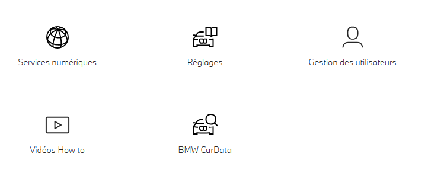
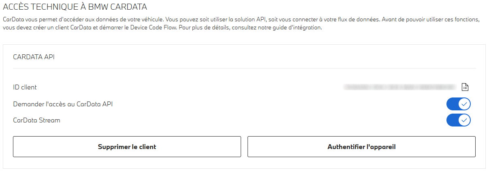
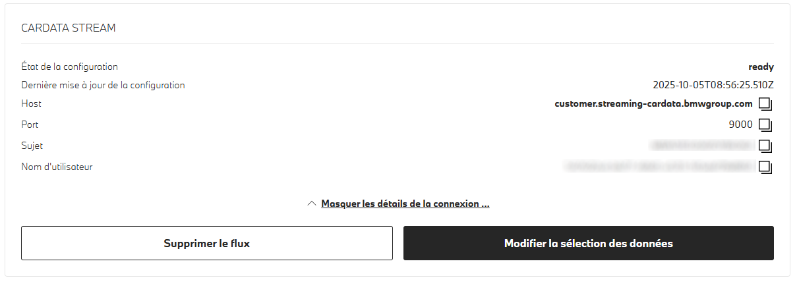
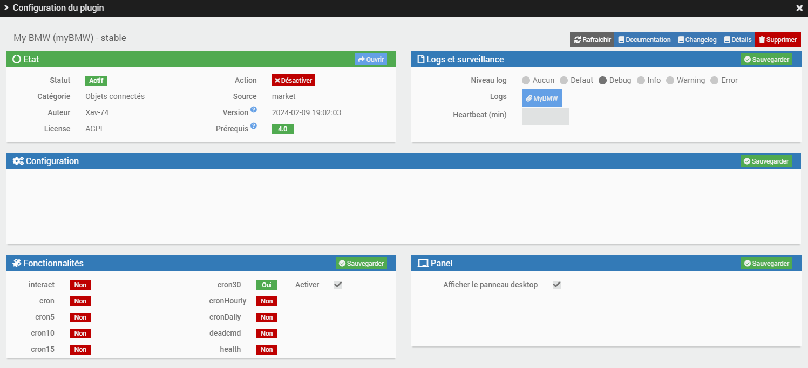
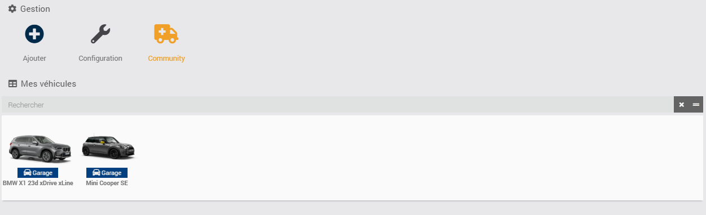
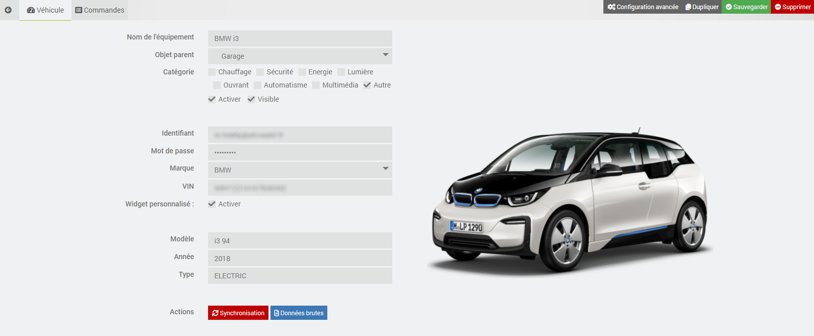
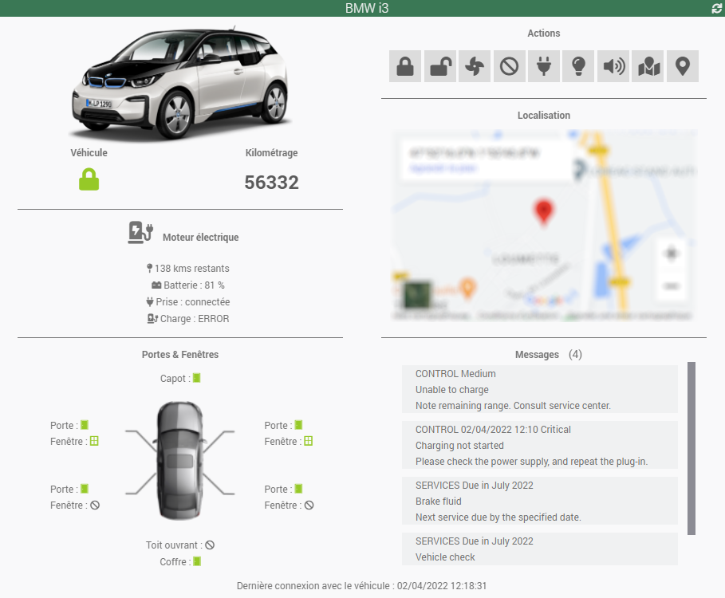
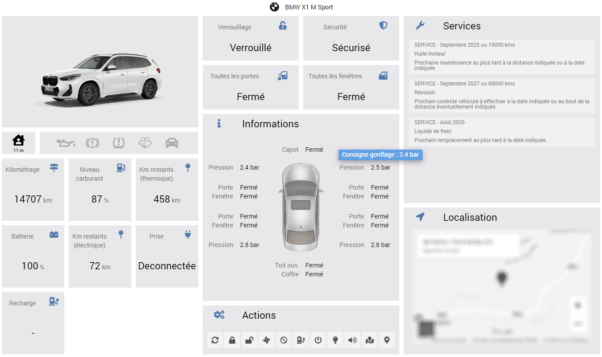
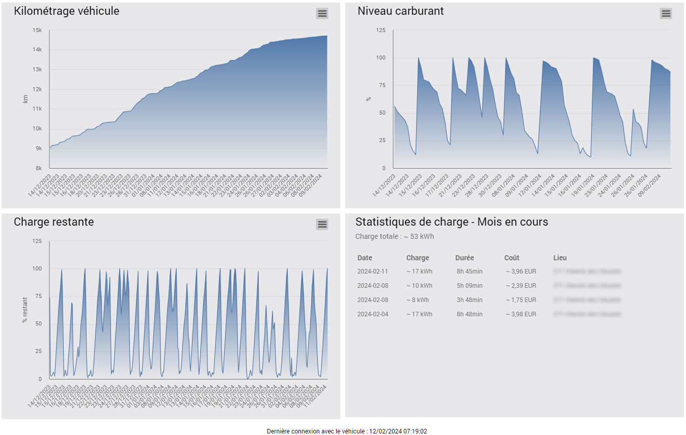

# Apresentação

Este plugin permite-lhe interagir com o seu veículo **BMW** ou **Mini** equipado com os serviços Connected Drive, tal como a aplicação oficial «My BMW» ou «Mini».

> **Dica**
>
> A **versão mínima do Jeedom** necessária para o bom funcionamento do plugin é a **versão 4.2**
> O plugin já é compatível com a **versão 4.5** do Jeedom, bem como com as **versões Debian 11 e 12**


# Princípio

Este plugin interage com as **API oficiais do BMW Connected Drive** através da nuvem; por conseguinte, **este plugin requer uma ligação à Internet**.
É igualmente necessário dispor de uma subscrição válida dos serviços BMW Connected Drive para o seu veículo, bem como de uma conta de utilizador **principal** válida para a aplicação «My BMW» ou «Mini».


# Configuração da sua conta de utilizador BMW ou Mini

Antes de poder utilizar o plugin, tem de configurar a sua conta de utilizador BMW. Siga cuidadosamente os passos seguintes:

1. Inicie sessão no portal **[BMW ConnectedDrive](https://www.bmw.fr/fr-fr/mybmw/vehicle-overview)** ou **[Mini ConnectedDrive](https://www.mini.fr/fr-fr/mymini/vehicle-overview)**
3. Clique no ícone **BMW CarData**



4. Clique no botão **«Criar um cliente CarData»**
5. Guarde **o ID de cliente** num local seguro!
4. Aguarde **30 segundos**
6. Clique em **"Solicitar acesso à API CarData"**
7. Aguarde **30 segundos** (se o botão não voltar para «off» e não aparecer nenhuma mensagem de erro, pode continuar; caso contrário, terá de repetir este passo)
8. Clique em **"CarData Streaming"**
9. Aguarde **30 segundos** (se o botão não voltar para «off» e não aparecer nenhuma mensagem de erro, pode continuar; caso contrário, terá de repetir este passo)



10. Aceda à secção **CarData Stream**
11. Verifique se o estado da ligação está em **"ready"**



12. Clique no botão **«Alterar a seleção de dados»**
13. Selecione **«Todas as categorias»** (Estado do veículo, Carregamento, Dados da viagem, etc.) e, em seguida, clique várias vezes no botão **Carregar** para visualizar todos os atributos
12. Selecione **manualmente** os 244 atributos individuais ou prima F12 para aceder à **consola do programador** e digite: (não é possível copiar e colar)
```
document.querySelectorAll('label.chakra-checkbox:not([data-checked])').forEach(l => l.click());
```
14. Em seguida, **guarde** a sua configuração
15. Guarde **o nome de utilizador** num local seguro!

**É importante que todos os atributos estejam assinalados para receber todos os dados do veículo.**


# Configuração do plugin

Após descarregar o plugin, basta ativá-lo e, em seguida, configurar o ID do cliente e o nome de utilizador obtidos na etapa anterior. Deixe os restantes campos em branco, salvo indicação expressa do programador.
Em seguida, aguarde até que a instalação das dependências termine e o daemon seja iniciado.

> **Dica**
>
> Para facilitar um pedido de assistência remota, recomenda-se definir os registos no **modo de depuração**.




# Adicionar um veículo

A configuração dos equipamentos MyBMW está disponível no menu Plugin > Objetos conectados.



Clique no botão «Adicionar» para criar um novo veículo. Depois de o adicionar, ficará com:

-   **Nome do equipamento**: nome do seu veículo
-   **Objeto pai**: indica o objeto pai ao qual o equipamento pertence
-   **Categoria**: a categoria do equipamento
-   **Ativar**: permite ativar o seu equipamento
-   **Visível**: torna o seu equipamento visível no painel de controlo
-   **Marca**: indique a marca do seu veículo (BMW ou Mini)
-   **VIN**: indique o número VIN ou Vehicle Identification Number (Número de identificação do veículo). Pode encontrar este número na casa E do seu cartão de matrícula. Este número é composto por 17 caracteres.
-   **Exibição do estado das portas/janelas**: pode escolher entre duas opções para a exibição do estado das portas e janelas no painel: o modo de texto ou o modo de ícones.
-   **Cor dos ícones das portas/janelas**: se tiver escolhido o modo de ícones, também pode decidir a cor dos ícones (verde ou preto e branco).
-   **Residência (presença)**: tem 3 opções para indicar as coordenadas GPS da sua residência: pode utilizar as coordenadas introduzidas no Jeedom, as coordenadas atuais do veículo ou introduzir manualmente a latitude e a longitude.
-   **Distância máxima (em m)**: indique a distância máxima, em metros, entre a sua residência e o veículo para que este seja considerado como estando na sua residência.

Em seguida, basta clicar no botão **Autenticação** para obter as informações do seu veículo (se estiverem disponíveis, irá obter o modelo, o ano, o tipo de motorização e uma imagem do seu veículo). Será exibida uma janela pop-up **(atenção ao bloqueador do seu navegador; desative-o, se necessário)** para que se autentique com o nome de utilizador (e-mail) e a palavra-passe da sua conta BMW. Tem 5 minutos para o fazer e, no final, deverá receber a mensagem **Ligação bem-sucedida**.

> **Dica**
>
> Não se esqueça de **guardar** as suas informações!
> Ao guardar, serão criados novos comandos no equipamento.




# Dados brutos

Para facilitar a depuração em caso de problema, pode obter os dados brutos do seu veículo clicando no botão **Dados brutos**. Atenção: antes de os copiar para o fórum, por exemplo, não se esqueça de ocultar informações confidenciais, como o número de VIN!


# Comandos

Existem atualmente vários comandos, que são descritos abaixo.

> **Dica**
>
>Se o comando devolver «not available», significa que a informação correspondente não está presente no seu veículo.

## Informações

-   **Marca**
-   **Modelo**
-   **Ano**
-   **Tipo**: elétrico, térmico ou híbrido
-   **Quilometragem**: quilometragem total do veículo
-   **Bloqueio**: apresenta o estado de bloqueio do veículo
-   **Estado da porta do condutor da frente**
-   **Estado da porta do condutor traseiro**
-   **Estado da porta do passageiro da frente**
-   **Estado da porta do passageiro traseiro**
-   **Estado de todas as portas**
-   **Estado da janela do condutor da frente**
-   **Estado da janela do condutor traseiro**
-   **Estado da janela do passageiro da frente**
-   **Estado da janela do passageiro traseiro**
-   **Estado de todas as janelas**
-   **Estado do cofre**
-   **Estado da tampa do motor**
-   **Estado do teto de abrir**
-   **Pressão do pneu dianteiro esquerdo**
-   **Instruções para o enchimento do pneu dianteiro esquerdo**
-   **Pressão do pneu dianteiro direito**
-   **Instruções para o enchimento do pneu dianteiro direito**
-   **Pressão do pneu traseiro esquerdo**
-   **Instruções para o enchimento do pneu traseiro esquerdo**
-   **Pressão do pneu traseiro direito**
-   **Instruções para o enchimento do pneu traseiro direito**
-   **Estado da carga** (apenas em veículos elétricos ou híbridos)
-   **Estado da tomada** (apenas em veículos elétricos ou híbridos)
-   **Hora de fim do carregamento** (apenas em veículos elétricos ou híbridos)
-   **Carga restante** (apenas em veículos elétricos ou híbridos)
-   **Quilómetros restantes (elétricos)** (motor elétrico e/ou híbrido)
-   **Combustível restante** (apenas em veículos a combustão ou híbridos)
-   **Quilómetros restantes (motor térmico)** (motor térmico)
-   **Mensagens**: apresenta as mensagens exibidas no veículo (controlo e serviços)
-   **Sessões de carregamento**: apresenta as estatísticas de carregamento das baterias no mês em curso (apenas em veículos elétricos ou híbridos)
-   **Consumo elétrico total**: indica o consumo elétrico total registado no mês em curso (apenas em veículos elétricos ou híbridos)
-   **Custo total da eletricidade**: indica o custo mensal dos encargos com a eletricidade
-   **Objetivo de recarga**: indica o objetivo de recarga elétrica configurado para o veículo (em %)
-   **Limite de corrente de carga**: indica o limite da corrente de carga utilizada quando o veículo está ligado à rede
-   **Limitação da corrente de carga**: fornece informação sobre o estado de ativação ou não de um limite da corrente de carga no veículo
-   **Coordenadas GPS**: indica a posição do veículo no formato «latitude,longitude»
-   **Última atualização**: indica a data e a hora da última ligação entre o automóvel e os servidores da BMW
-   **Estado de desbloqueio**: devolve o último estado recebido durante um pedido de desbloqueio. Se a ação tiver sido executada com sucesso, o estado passa de «PENDING» para «EXECUTED». Caso contrário, devolve «ERROR»
-   **Estado: Bloquear**
-   **Estado: A carregar**
-   **Estado «Parar carregamento»**
-   **Estado: Ventilador**
-   **Estado «Parar ventilação»**
-   **Estado «Piscar de faróis»**
-   **Estado do Klaxonner**
-   **Pesquisar estado**
-   **Estado do envio do POI**
-   **Presença em casa**: indica se o seu veículo se encontra na sua residência (1 = presente, 0 = ausente) com base na distância máxima indicada
-   **Distância até casa**: indica a distância (em m ou km) entre o veículo e a sua casa


## Ação

-   **Atualizar**: atualiza todas as informações do veículo
-   **Trancar**: permite trancar o carro à distância
-   **Desbloquear**: permite desbloquear o carro à distância
-   **Carregar**: permite iniciar o carregamento do veículo
-   **Interromper o carregamento**: permite interromper o carregamento do veículo
-   **Ventilação (Iniciar)**: permite ligar o sistema de ventilação à temperatura definida no veículo
-   **Ventilação (Pausar)**: permite interromper o sistema de ventilação à temperatura definida no veículo
-   **Sinalização com os faróis**: aciona a sinalização com os faróis
-   **Tocar a buzina**: ativa um aviso sonoro
-   **Pesquisar**: localiza o veículo em tempo real e apresenta-o num mapa do Google Maps
-   **Envio de POI**: envio de um ponto de interesse (POI) para o centro de mensagens do veículo, introduzindo o nome, a latitude e a longitude do local

> **ATENÇÃO**
>
> Até ao momento, apenas a função **Atualizar** está operacional. As restantes ações voltarão a estar operacionais assim que as APIs da BMW o permitirem!


# Painel de controlo

O plugin inclui um widget personalizado que permite visualizar todas as informações essenciais do veículo.




# Painel

Se tiver marcado a opção **Mostrar o painel do ambiente de trabalho** na página de configuração do plugin, poderá visualizar um painel dedicado ao seu veículo que reúne todas as informações disponíveis neste plugin. Pode aceder-lhe através do menu **Página inicial \ My BMW**




> **Dica**
>
> Para que os gráficos sejam apresentados, não se esqueça de assinalar a opção **Registo** nos 3 comandos seguintes: Quilometragem, Carga restante e Combustível restante.


# Atualização

## Automático

Graças ao fluxo MQTT, recebe a maioria das informações do seu veículo em tempo real (quilometragem, combustível, bateria, estado de bloqueio do veículo, das portas e janelas, localização, ...)!
É também criada uma tarefa CRON personalizável (com uma frequência de duas em duas horas, 5 minutos após a hora) para recuperar as informações que não podem ser transmitidas em streaming (mensagens de controlo, de serviços, histórico de carga). Tenha cuidado para não aumentar demasiado esta frequência, sob pena de exceder os limites de pedidos autorizados pela BMW (50 por dia)!

## Manual

Pode utilizar a qualquer momento o comando **Atualizar** para obter o estado dos veículos.

>**Atenção**
>
>A BMW permite apenas 50 pedidos por dia, por isso não atualize manualmente com demasiada frequência (o CRON atual utiliza 24 pedidos por dia), sob pena de ficar bloqueado até ao dia seguinte.


# Plano de desenvolvimento e suporte

Este plugin irá evoluir ao longo do tempo, de acordo com os vossos pedidos e com as possibilidades das APIs do BMW Connected Drive.

As próximas versões incluirão as seguintes funcionalidades:
-   Adição de novas funcionalidades com base nas possibilidades oferecidas pelas API
-   Tradução do plugin para inglês
-   ...

> **Dica**
>
>Pode enviar o seu pedido de melhoria criando um «issue» de «melhoria» no [GitHub](https://github.com/Xav-74/myBMW/issues/new).
>Não hesitem também em participar na discussão sobre este plugin na Comunidade Jeedom!

Em caso de avaria, pode criar diretamente um tópico na Comunidade a partir da página principal do plugin. As informações úteis do Jeedom e do plugin são adicionadas automaticamente. Não hesite também em copiar os registos myBMW, myBMW_daemon e myBMW_update (modo de depuração) para uma resolução mais rápida!


