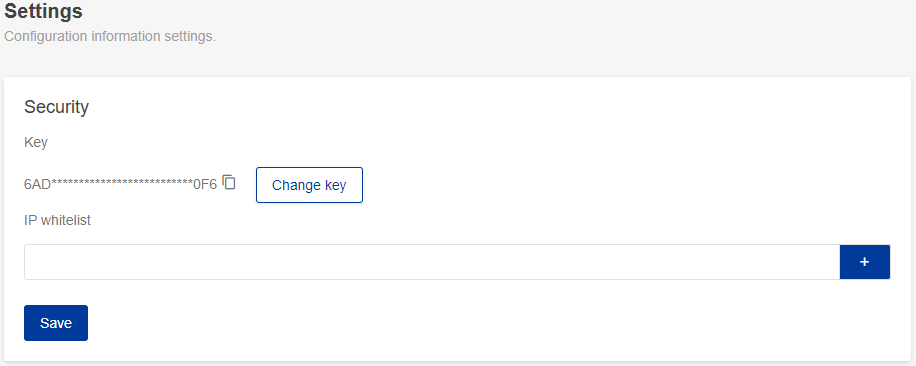
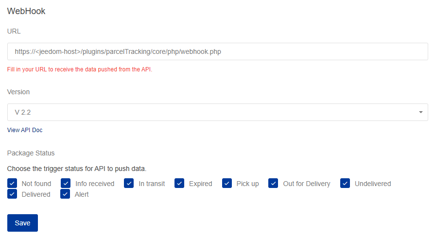
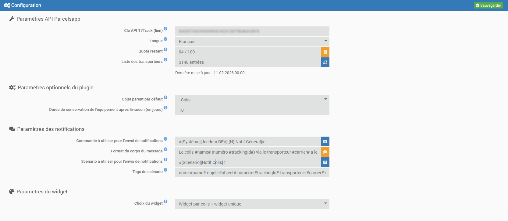
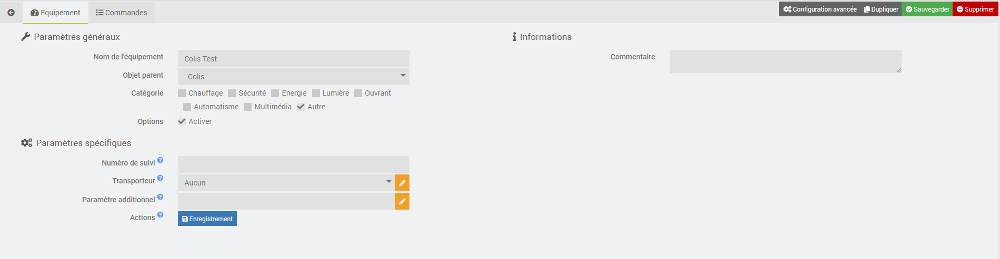
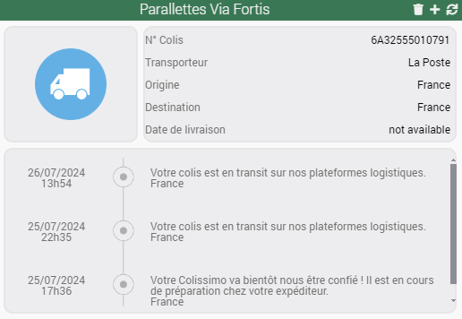
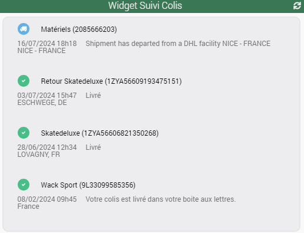

# Presentación

Este complemento te permite realizar el seguimiento de tus paquetes de las principales empresas de transporte francesas e internacionales (La Poste, Mondial Relay, Relais Colis, Colis Privé, Aliexpress, Shein, Amazon, eBay, FedEx, UPS, etc.) a través de la API de [**17Track**](https://www.17track.net/en).

El plan gratuito de 17Track permite realizar el seguimiento de 100 paquetes al mes (el contador se pone a 0 el primer día del mes). Si lo deseas, puedes contratar un plan superior de pago.

> **Consejo**
>
> La **versión mínima de Jeedom** necesaria para que el complemento funcione correctamente es la **versión 4.4**
>
> El complemento ya es compatible con las **versiones Debian 11 y 12**

# Instalación

El complemento se instala como cualquier otro complemento en Jeedom, a través del Market.

# Configuración

1. Una vez instalado y activado, en la página de configuración debes introducir la clave API de 17Track
2. Visita la página web [www.17track.net](https://user.17track.net/en)
3. Haz clic en **No tengo cuenta** y crea una cuenta de **Desarrollador**, o inicia sesión con tus datos de acceso actuales
4. Una vez en tu panel de control, ve al menú **Configuración** y copia la clave API
5. Pega la clave API en la configuración del complemento

6. Rellena también la sección «Webhook» de la siguiente manera: («jeedom-host» es la dirección externa de tu dispositivo)

7. Puedes consultar el número de seguimientos que te quedan en tu cuota haciendo clic en el botón **Comprobar**
8. Selecciona el idioma que se utilizará para las respuestas de la API. Atención: si eliges un idioma distinto al predeterminado, se te descontarán 2 seguimientos por paquete de tu cuota.
9. Puedes actualizar la lista de transportistas y la lista de parámetros adicionales. Por defecto, se actualizarán cada día durante la tarea programada diaria.
10. Introduce los parámetros opcionales del plugin:
    - Objeto principal por defecto ==> Incorporación automática del objeto especificado al crear nuevos seguimientos
    - Periodo de conservación del equipo tras la entrega (en días) ==> Eliminación automática del equipo X días después de su entrega
11. Configure los parámetros de notificaciones si desea recibir un aviso cada vez que cambie el estado
    - Las dos primeras líneas se refieren al envío de notificaciones mediante un comando de acción de tipo «mensaje».

Opción: puedes personalizar el mensaje utilizando las siguientes etiquetas: `#name#`, `#trackingId#`, `#carrier#`, `#status#`, `#lastState#`, `#date#` y `#time#`

Puedes comprobar que todo funciona correctamente enviando una notificación de prueba
    - Las dos últimas líneas se refieren al envío de notificaciones a través de un escenario

Puedes utilizar las siguientes etiquetas: `#name#`, `#object#`, `#trackingId#`, `#carrier#`, `#status#`, `#lastState#`, `#date#` y `#time#`

Funcionan así: `nombredelseguimiento=#name#`, donde «nombredelseguimiento» es el nombre de la etiqueta y «#name#» es el valor de la etiqueta.
12. Introduce los parámetros del widget. Hay tres opciones posibles:
    - Sin widgets (solo recibirás notificaciones)
    - Un widget por paquete
    - Un widget único para todos los paquetes
13. Guardar

> **Consejo**
>
> Para facilitar la solicitud de asistencia remota, se recomienda configurar los registros en **modo depuración**.

# Uso

1. Inicia el complemento que se encuentra en la categoría **Organización** del menú **Complementos**
2. Añadir un paquete, como cualquier otro dispositivo en Jeedom
3. Indica el nombre de tu paquete y, a continuación, introduce el número de seguimiento, el transportista si lo conoces y el parámetro adicional necesario para el seguimiento, si es obligatorio. La lista de transportistas procede directamente de 17Track y se actualizará periódicamente. Si se requiere un parámetro adicional para el transportista seleccionado, aparecerá una nota para indicártelo y indicarte el formato que debe tener.
4. Guarda y, a continuación, inicia un **registro** para que el paquete quede registrado en las API de 17Track y comprueba que la acción se haya realizado correctamente (notificación verde).

> **Consejo**
>
> Si, tras el primer registro **correcto**, necesitas modificar el transportista y/o el parámetro adicional, puedes hacerlo mediante los botones de actualización. Atención: en ocasiones, tras actualizar uno de los dos parámetros, la información de seguimiento no se actualiza de inmediato. Espere entre 1 y 2 horas. Transcurrido este tiempo, es preferible eliminar el envío y volver a crearlo **con todos los parámetros actualizados desde el primer registro**.

# Controles

Actualmente existen varios comandos que se describen a continuación.

> **Consejo**
>
> Si la consulta devuelve «no disponible», significa que la información correspondiente no figura en el seguimiento del paquete.

## Información

| Control | Descripción |
|---|---|
| **Estado del paquete** | 5 estados posibles (entregado, en tránsito, a recoger, llegado, archivado) |
| **Transportista** | nombre del transportista principal |
| **Origen** | país de origen del paquete |
| **Destino** | país de destino del paquete |
| **Estados** | lista de todas las etapas de la entrega |
| **Último evento** | Fecha y hora del último evento enviado por el transportista. Se utiliza para el envío de notificaciones |
| **Último estado** | último estado enviado por el transportista. Se utiliza para el envío de notificaciones |
| **Fecha de entrega** | solo está disponible cuando se ha entregado el paquete |

## Acción

| Control | Descripción |
|---|---|
| **Actualizar** | actualiza toda la información del paquete |

# Panel de control

El plugin incluye dos widgets personalizados que permiten mostrar toda la información de los paquetes. Puedes elegir entre:

- un widget por paquete

- un widget único para todos los paquetes

- los widgets anteriores en paralelo

En cualquier caso, tienes la posibilidad de eliminar los paquetes (icono ) o añadir uno nuevo (icono ) directamente desde los widgets.

> **Atención**
>
> El widget único aparece en la página de dispositivos del complemento. No debe eliminarse bajo ningún concepto. Si se elimina por error, basta con forzar una reinstalación del complemento (sin pérdida de datos) y se volverá a crear.

# Actualización

## Automático

Tal y como se indica en la página de configuración del complemento:

- Se crea automáticamente una tarea CRON a diario (a las 00:00) para la eliminación automática de los paquetes

En cuanto a la actualización de los envíos, el webhook recupera en tiempo real la información transmitida por 17Track.

## Manual

Puede utilizar en cualquier momento el comando **Actualizar** para actualizar la información de los paquetes.

# Hoja de ruta y asistencia técnica

Este complemento irá evolucionando con el tiempo en función de vuestras peticiones y de las posibilidades que ofrezcan las API de 17Track.

Las próximas versiones incluirán las siguientes funciones:

- Configuración de un WebHook para recibir datos en tiempo real
- ...

> **Consejo**
>
> Puedes enviar tu solicitud de mejora creando una incidencia de «mejora» en [GitHub](https://github.com/Xav-74/parcelTracking/issues/new).
>
> ¡No dudes en venir a compartir tus opiniones sobre este complemento en la comunidad de Jeedom!

En caso de fallo, puedes crear directamente un tema en la Comunidad desde la página principal del complemento. La información relevante de Jeedom y del complemento se añade automáticamente. ¡No dudes en copiar también los registros de parcelTracking (modo depuración) para una resolución más rápida!

