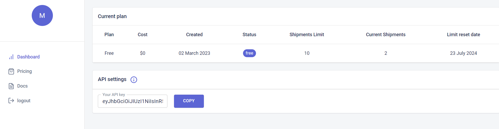
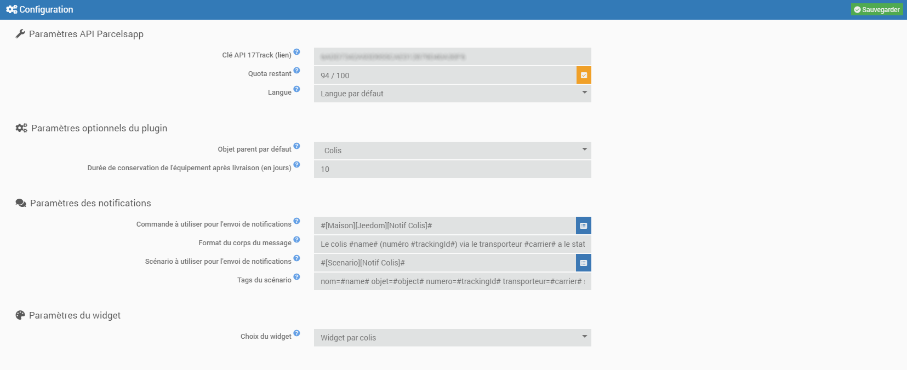
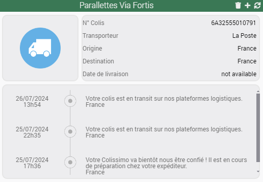
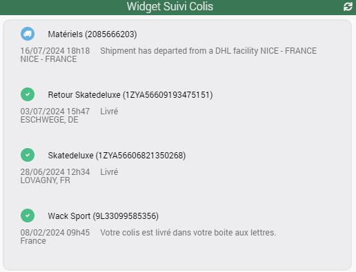
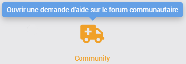

# Présentation

Ce plugin vous permet de suivre vos colis en provenance des principaux transporteurs français et internationaux (La Poste, Mondial Relay, Relais Colis, Colis Privé, Aliexpress, Shein, Amazon, eBay, FedEx, UPS, ...) via l'API de [**Parcelsapp**](https://parcelsapp.com/fr). 
Le plan gratuit de Parcelsapp propose le suivi de 10 colis sur 30 jours glissants. Si vous le souhaitez, vous pouvez prendre un plan supérieur.

> **Tip**
>
> La **version minimale de Jeedom** nécessaire au bon fonctionnement du plugin est la **version 4.4**
> Le plugin est d'ors et déjà compatible avec les **versions Debian 11 & 12**

# Installation

Le plugin s'installe comme n'importe quel autre plugin sur Jeedom, via le Market.

# Configuration

1. Une fois installé et activé, sur la page de configuration, vous devez indiquer Clé API Parcelsapp
2. Rendez-vous sur le site [www.parcelsapp.com](https://parcelsapp.com/dashboard/#/login)
3. Créez un compte ou se connecter avec l'existant
4. Allez sur votre dashboard et copiez la clé API
5. Collez la clé API dans la configuration du plugin
   
6. Renseignez la langue utilisée pour les retours API (français ou anglais) et les paramètres optionnels du plugin :
 - Objet parent par défaut ==> Ajout automatique de l'objet spécifié lors de la création de nouveaux suivis
 - Code postal par défaut ==> Ajout automatique du code postal du destinataire spécifié lors de la création de nouveaux suivis
 - Durée de conservation de l'équipement après livraison (en jours) ==> Suppression automatique de l'équipement X jours après sa livraison
7. Renseignez les paramètres de notifications si vous souhaitez être informés à chaque changement de statut
 - Les 2 premières lignes concernent l'envoi des notifications via une commande action de type message 
   Option : vous pouvez personnaliser le message en utilisant les tags suivants : #nom#, #numColis#, #transporteur#, #statut#, #dernierEtat#, #date# et #heure#
 - Les 2 dernières lignes concernent l'envoi des notifications via un scénario
   Vous pouvez utiliser les tags suivants : #nom#, #objet#, #numColis#, #transporteur#, #statut#, #dernierEtat#, #date# et #heure#.
   Ils fonctionnent ainsi ; nomdusuivi=#nom# où nomdusuivi est le nom du tag et #nom# la valeur du tag
8. Renseignez les paramètres du widget
  3 choix possibles :
  - Aucun widget (vous recevrez uniquement les notifications)
  - Un widget par colis
  - Un widget unique pour l'ensemble des colis
9. Sauvegardez

  

> **Tip**
>
> Pour faciliter une demande d'aide à distance, il est conseillé de régler les logs en **mode debug**. 

# Utilisation
1. Lancer le plugin qui se trouve dans la catégorie **Organisation** du menu **Plugins**
2. Ajouter un colis, comme n'importe quel équipement sous Jeedom
3. Indiquer le nom de votre colis puis renseigner le numéro de suivi, son pays et code postal de destination, sauf si les informations ont déjà été pré-remplies dans la configuration du plugin
5. Sauvegarder
6. Si vous ne souhaitez pas attendre l'actualisation automatique, vous pouvez la forcer en cliquant sur le bouton **Synchronisation**. Attention, lors de la synchronisation, aucune notification n'est envoyée.

# Commandes

Il existe actuellement plusieurs commandes qui sont décrites ci-dessous.

> **Tip**
>
>Si la commande renvoie "not available", c'est que l'information correspondante n'est pas présente sur le suivi du colis.

## Info

- **Statut colis** : 5 états possibles (delivered, transit, pickup, arrived, archive)
- **Transporteur** : nom du transporteur principal
- **Origine** : pays d'origine du colis
- **Destination** : pays de destinatiuon du colis
- **Etats** : liste de toutes les étapes de la livraison
- **Dernier état** : dernier état envoyé par le transporteur. Utilisé pour l'envoi des notifications
- **Date de livraison** : uniquement disponible lorsque le colis a été livré

## Action

- **Rafraichir** : met à jour l'ensemble des informations du colis

# Dashboard

Le plugin inclut 2 widgets personnalisés qui permettent d'afficher l'ensemble des informations des colis. Vous pouvez choisir soit :
- un widget par colis

- un widget unique pour l'ensemble des colis

**Attention :** Le widget unique est visible sur la page des équipements du plugin. Il ne doit en aucun cas être supprimé. S'il l'est par erreur, il vous suffit de forcer une réinstallation du plugin (pas de perte des données) et celui-ci sera recréé.

# Rafraichissement

## Automatique

Comme indiqué dans la page de configuration du plugin :
- un CRON est automatiquement créé sur une base de 1 heure pour le rafraichissement des informations des colis
- un second CRON est automatiquement créé sur base quotidienne (à 00h00) pour la suppression automatique des colis

## Manuel

Vous pouvez à tout moment utiliser la commande **Rafraichir** afin d'actualiser les informations des colis.

# Roadmap & support

Ce plugin évoluera au fil du temps en fonction de vos demandes et des possibilités des API Parcelsapp.

Les prochaines versions verront arriver les features suivantes :
- Ajout d'une seconde clé API pour passage à 20 colis sur 30 jours glissants
- Possibilité d'ajouter ou de supprimer un colis depuis le widget global
- Traduction du plugin en anglais
- ...

> **Tip**
>
>Vous pouvez faire votre demande d'amélioration en créant une issue "enhancement" sur [GitHub](https://github.com/Xav-74/parcelTracking/issues/new).
>N'hésitez pas non plus à venir échanger sur ce plugin sur le Community Jeedom !

En cas de dysfonctionnement, vous pouvez créer directement un sujet sur le Community depuis la page principale du plugin. Les informations utiles de Jeedom et du plugin sont automatiquement ajoutées. N'hésitez pas également à copier les logs parcelTracking (mode debug) pour une résolution plus rapide !

