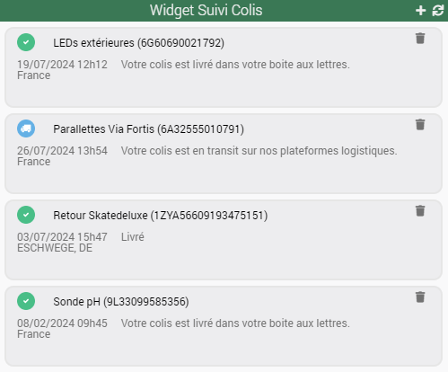

# Présentation

Ce plugin vous permet de suivre vos colis en provenance des principaux transporteurs français et internationaux (La Poste, Mondial Relay, Relais Colis, Colis Privé, Aliexpress, Shein, Amazon, eBay, FedEx, UPS, ...) via l'API de [**17Track**](https://www.17track.net/en). 
Le plan gratuit de 17Track propose le suivi de 100 colis par mois (remise à 0 le 1er jour du mois). Si vous le souhaitez, vous pouvez prendre un plan supérieur payant.

> **Tip**
>
> La **version minimale de Jeedom** nécessaire au bon fonctionnement du plugin est la **version 4.4**
> Le plugin est d'ors et déjà compatible avec les **versions Debian 11 & 12**

# Installation

Le plugin s'installe comme n'importe quel autre plugin sur Jeedom, via le Market.

# Configuration

1. Une fois installé et activé, sur la page de configuration, vous devez indiquer Clé API 17Track
2. Rendez-vous sur le site [www.17track.net](https://user.17track.net/en)
3. Cliquez sur **No account** et créez un compte **Développeur**, ou se connecter avec vos identifiants existants
4. Une fois sur votre dashboard, allez dans le menu **Settings** et copiez la clé API
5. Collez la clé API dans la configuration du plugin
    

6. Vous pouvez consulter le nombre de suivi restant sur votre quota en cliquant sur le bouton **Vérifier**
7. Sélectionnez la langue utilisée pour les retours API. Attention, si vous choisissez une langue autre que par défaut, cela décomptera 2 suivis par colis sur votre quota
8. Renseignez les paramètres optionnels du plugin :
 - Objet parent par défaut ==> Ajout automatique de l'objet spécifié lors de la création de nouveaux suivis
 - Durée de conservation de l'équipement après livraison (en jours) ==> Suppression automatique de l'équipement X jours après sa livraison
9. Renseignez les paramètres de notifications si vous souhaitez être informés à chaque changement de statut
 - Les 2 premières lignes concernent l'envoi des notifications via une commande action de type message 
   Option : vous pouvez personnaliser le message en utilisant les tags suivants : #name#, #trackingId#, #carrier#, #status#, #lastState#, #date# et #time#
 - Les 2 dernières lignes concernent l'envoi des notifications via un scénario
   Vous pouvez utiliser les tags suivants : #name#, #object#, #trackingId#, #carrier#, #status#, #lastState#, #date# et #time#
   Ils fonctionnent ainsi : nomdusuivi=#name# où nomdusuivi est le nom du tag et #name# la valeur du tag
10. Renseignez les paramètres du widget
  3 choix possibles :
  - Aucun widget (vous recevrez uniquement les notifications)
  - Un widget par colis
  - Un widget unique pour l'ensemble des colis
11. Sauvegardez

  

> **Tip**
>
> Pour faciliter une demande d'aide à distance, il est conseillé de régler les logs en **mode debug**. 

# Utilisation
1. Lancer le plugin qui se trouve dans la catégorie **Organisation** du menu **Plugins**
2. Ajouter un colis, comme n'importe quel équipement sous Jeedom
3. Indiquer le nom de votre colis puis renseigner le numéro de suivi, le transporteur si vous le connaissez et le paramètre additionnel nécessaire au suivi s'il est obligatoire. La liste des transporteurs provient directement de 17Track et sera mise à jour régulièrement. Si un paramètre additionnel est nécessaire pour le transporteur sélectionné, une note apparaitra pour vous le signaler et vous donner son format attendu 
4. Sauvegarder puis lancez un **enregistrement** afin que le colis soit pris en compte par les API 17Track et assurez-vous du succès de cette action (notification verte)

> **Tip**
>
>Si, à l'issue du premier enregistrement **réussi**, vous devez modifier le transporteur et/ou le paramètre additionnel, vous pouvez le faire gràce aux boutons de mise à jour. Attention, il arrive parfois qu'à l'issue d'une mise à jour de l'un des 2 paramètres, les informations de suivi ne remontent pas immédiatement. Patientez 1 à 2 heures. Passé ce délai, il est préférable de supprimer le colis, et de le recréer **avec l'ensemble des paramètres à jour dès le premier enregistrement**

  

# Commandes

Il existe actuellement plusieurs commandes qui sont décrites ci-dessous.

> **Tip**
>
>Si la commande renvoie "indisponible", c'est que l'information correspondante n'est pas présente sur le suivi du colis.

## Info

- **Statut colis** : 5 états possibles (delivered, transit, pickup, arrived, archive)
- **Transporteur** : nom du transporteur principal
- **Origine** : pays d'origine du colis
- **Destination** : pays de destinatiuon du colis
- **Etats** : liste de toutes les étapes de la livraison
- **Dernier évènement** : date et heure du dernier évènement envoyé par le transporteur. Utilisé pour l'envoi des notifications
- **Dernier état** : dernier état envoyé par le transporteur. Utilisé pour l'envoi des notifications
- **Date de livraison** : uniquement disponible lorsque le colis a été livré

## Action

- **Rafraichir** : met à jour l'ensemble des informations du colis

# Dashboard

Le plugin inclut 2 widgets personnalisés qui permettent d'afficher l'ensemble des informations des colis. Vous pouvez choisir soit :
- un widget par colis

- un widget unique pour l'ensemble des colis

Dans les 2 cas, vous avez la possibilité de supprimer les colis (icône ) ou d'en ajouter un nouveau (icône ) depuis les widgets directement.

**Attention :** Le widget unique est visible sur la page des équipements du plugin. Il ne doit en aucun cas être supprimé. S'il l'est par erreur, il vous suffit de forcer une réinstallation du plugin (pas de perte des données) et celui-ci sera recréé.

# Rafraichissement

## Automatique

Comme indiqué dans la page de configuration du plugin :
- un CRON est automatiquement créé sur une base de 1 heure pour le rafraichissement des informations des colis
- un second CRON est automatiquement créé sur base quotidienne (à 00h00) pour la suppression automatique des colis

## Manuel

Vous pouvez à tout moment utiliser la commande **Rafraichir** afin d'actualiser les informations des colis.

# Roadmap & support

Ce plugin évoluera au fil du temps en fonction de vos demandes et des possibilités des API 17Track.

Les prochaines versions verront arriver les features suivantes :
- Mise en place d'un WebHook pour une réception des données en temps réel
- ...

> **Tip**
>
>Vous pouvez faire votre demande d'amélioration en créant une issue "enhancement" sur [GitHub](https://github.com/Xav-74/parcelTracking/issues/new).
>N'hésitez pas non plus à venir échanger sur ce plugin sur le Community Jeedom !

En cas de dysfonctionnement, vous pouvez créer directement un sujet sur le Community depuis la page principale du plugin. Les informations utiles de Jeedom et du plugin sont automatiquement ajoutées. N'hésitez pas également à copier les logs parcelTracking (mode debug) pour une résolution plus rapide !

