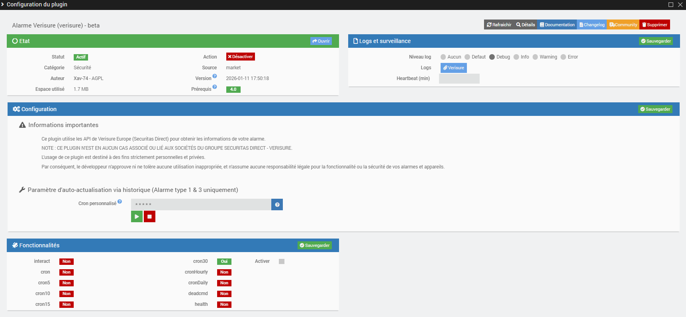
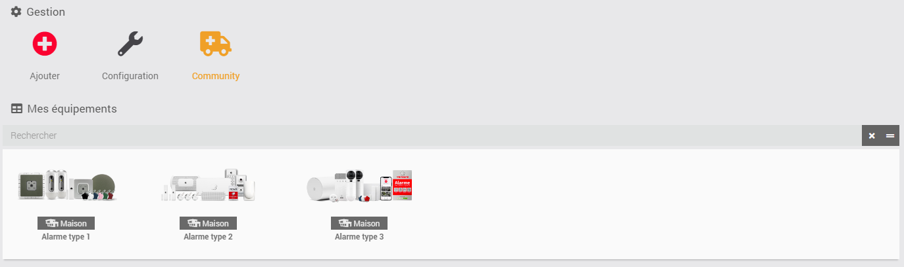
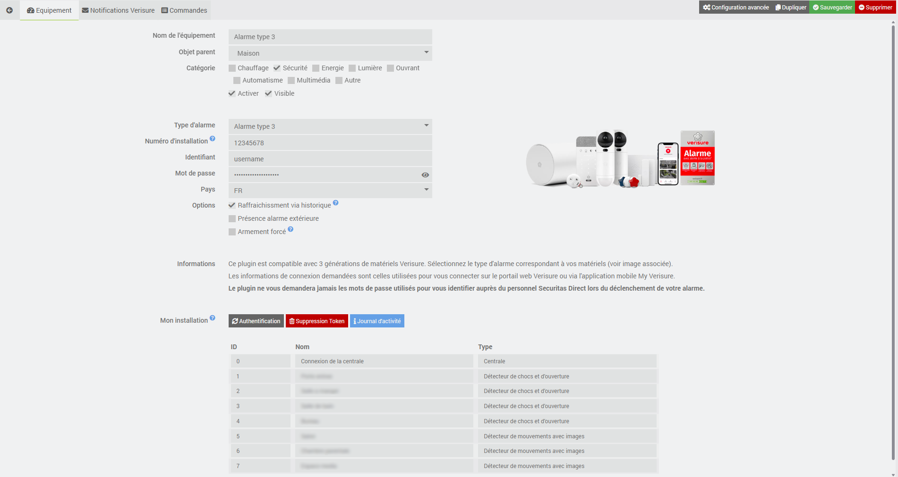
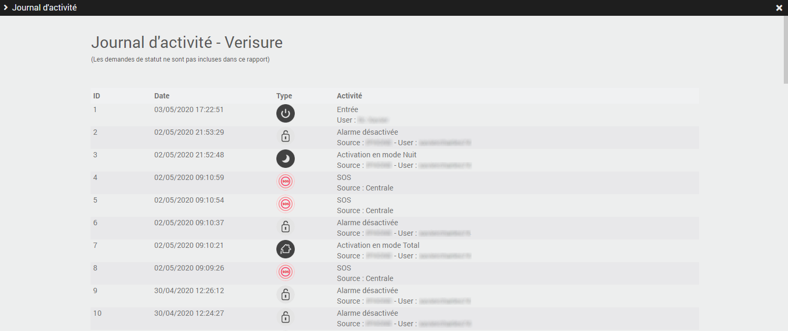
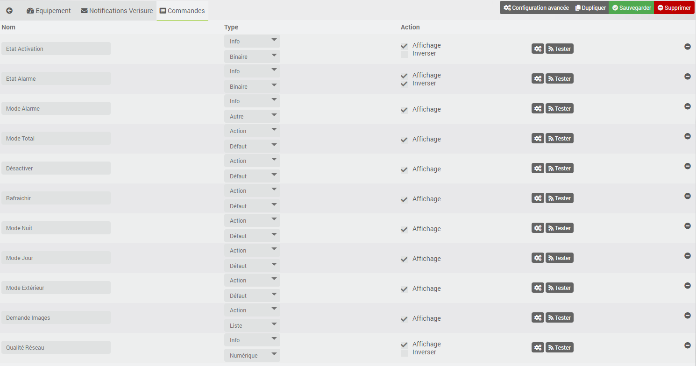
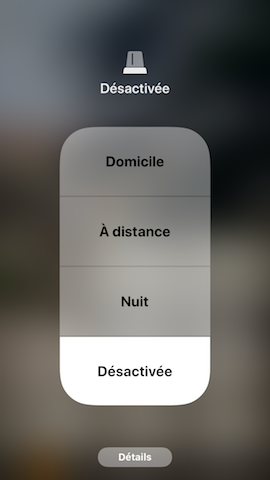
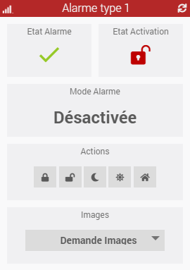
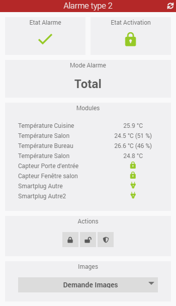
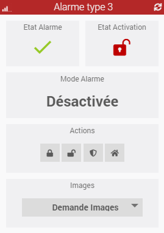

# Presentación

Este complemento de Jeedom te permite interactuar con tu alarma de Verisure Europe (Securitas Direct) de la misma forma que la aplicación oficial «My Verisure».
Es compatible con tres generaciones de dispositivos Verisure.

> **Importante**
>
> **ESTE COMPLEMENTO NO ESTÁ ASOCIADO NI VINCULADO EN ABSOLUTO A LAS EMPRESAS DEL GRUPO SECURITAS DIRECT - VERISURE.**
>
> El uso de este complemento está destinado exclusivamente a fines personales y privados.
> Por lo tanto, el desarrollador no aprueba ni tolera ningún uso inadecuado, y no asume ninguna responsabilidad legal por el funcionamiento o la seguridad de tus alarmas y dispositivos.

<!-- -->

> **Consejo**
>
> La **versión mínima de Jeedom** necesaria para que el complemento funcione correctamente es la **versión 4.4**
> El complemento ya es compatible con la **versión 4.6** de Jeedom, así como con las **versiones de Debian 12**

# Principio

Este complemento interactúa con las API de Verisure a través de la nube, por lo que **este complemento requiere una conexión a Internet**.

También es necesario tener una suscripción a los servicios de Verisure. De hecho, este complemento solo se comunica con la central de tu alarma a través de sus infraestructuras en la nube. No interactúa directamente con la central ni con los dispositivos asociados. Si has dado de baja tu suscripción, este complemento no funcionará.

# Configuración del complemento

Una vez descargado el complemento, solo tienes que activarlo. Si dispones de una alarma de tipo 1 o 3, tienes la posibilidad de activar (y desactivar) un cron personalizado para actualizar la información de tu alarma en función del historial de acciones. No olvides activar la opción en la configuración de tu equipo.

> **Consejo**
>
> Para facilitar la solicitud de asistencia remota, se recomienda configurar los registros en **modo depuración**.

# Añadir una alarma

Se puede acceder a la configuración de los dispositivos de alarma desde el menú «Plugin > Seguridad».

Haz clic en el botón «Añadir» para crear una nueva alarma. Una vez añadida, tendrás lo siguiente:

| Campo | Descripción |
|---|---|
| **Nombre del dispositivo** | nombre de tu alarma |
| **Objeto principal** | indica el objeto principal al que pertenece el equipo |
| **Categoría** | la categoría del equipo (seguridad en general, en el caso de una alarma) |
| **Activar** | permite activar tu equipo |
| **Visible** | hace que tu equipo sea visible en el panel de control |
| **Tipo de alarma** | selección del tipo de alarma (tipo 1 = Europa del Sur (Francia, España, etc.) / tipo 2 = Europa del Norte (Bélgica, Reino Unido, etc.) / tipo 3 = nueva generación (desde 2022)) |
| **Número de instalación** (alarmas de tipo 1 y 3) | Indica tu número de instalación de Verisure. **¡Atención! Este número debe coincidir exactamente con el que aparece en tu aplicación My Verisure. Si tu número de instalación empieza por un 0, pero este no aparece en la aplicación, ¡elimínalo!** |
| **Identificador** (alarmas de tipo 1, 2 y 3) | Introduce tu nombre de usuario de Verisure, el que utilizas para iniciar sesión en la página web [https://customers.securitasdirect.fr](https://customers.securitasdirect.fr) o [https://mypages.verisure.com/](https://mypages.verisure.com) |
| **Contraseña** (alarmas de tipo 1, 2 y 3) | introduce tu contraseña |
| **Código de alarma** (alarma de tipo 2) | introduce el código PIN de tu alarma (4 o 6 dígitos) |
| **País** (alarmas de tipo 1 y 3) | Selecciona el país en el que está instalada tu alarma (países compatibles actualmente: Francia, España, Reino Unido, Italia y Portugal). Para las alarmas de tipo 2, la selección del país es automática (países compatibles actualmente: Bélgica, Países Bajos, Alemania, Gran Bretaña, Dinamarca, Finlandia, Noruega y Suecia) |

**Opciones** (alarmas de tipo 1 y 3): en función del tipo de alarma que tengas, puedes seleccionar las siguientes opciones:

| Opción | Descripción |
|---|---|
| **Actualización a través del historial** (alarmas de tipo 1 y 3) | permite actualizar los estados de la alarma en función del historial de acciones. Recuerda configurar y activar el cron en la configuración del complemento |
| **Alarma exterior de presencia** (alarma de tipo 3) | márquelo si dispone de detectores exteriores y si el modo exterior está activado en su alarma |
| **Activación forzada** (alarma de tipo 3) | permite forzar la activación de la alarma aunque haya quedado abierta una puerta o una ventana. ¡Bajo tu propia responsabilidad! |

A continuación, solo tienes que hacer clic en el botón **Autenticación** para recuperar la información de tu alarma. Si todo va bien, aparecerá una tabla con todos los dispositivos instalados en tu vivienda (ID, nombre y tipo).

> **Atención**
>
> Se recomienda encarecidamente crear, en tu espacio de Verisure, un usuario específico para Jeedom con derechos de «administrador». El complemento gestiona la autenticación multifactorial (MFA) para las alarmas de tipo 1. Lo mismo ocurre con las alarmas de tipo 2, pero se recomienda desactivar esta opción por el momento, ya que la actualización del token resulta muy engorrosa. En caso de problemas de conexión, el botón **Eliminar token** permite borrar las cookies guardadas y volver a realizar una autenticación inicial.

<!-- -->

> **Consejo**
>
> ¡No te olvides de **guardar** tus datos!
> Al guardar, se crearán nuevos comandos en el equipo.

# Registro de actividad

Puede consultar el registro de actividad de su alarma haciendo clic en el botón **Registro de actividad**. Este informe recoge los últimos sucesos que han tenido lugar en su centralita (alertas de intrusión, SOS, activación/desactivación, corte de electricidad).

# Notificaciones de Verisure

Las API de Verisure no permiten el envío directo de información ni notificaciones automáticas, como la activación o desactivación mediante una tarjeta o un mando a distancia, ni la activación de la alarma.
En esta pestaña se describe detalladamente cómo configurar Jeedom (escenarios) para subsanar esta carencia en:

- ¡**Notificaciones por correo electrónico** para activar o desactivar la alarma mediante el complemento [Mail Listener](https://www.jeedom.com/market/index.php?v=d&p=market&author=Lunarok&&name=maillistener) de Lunarok!
- ¡**Notificaciones por SMS** para activar o desactivar la alarma mediante el complemento [SMS](https://www.jeedom.com/market/index.php?v=d&p=market_display&id=16) de Jeedom SAS!

# Controles

Actualmente existen varios comandos que se describen a continuación.

## Información

| Control | Descripción |
|---|---|
| **Estado de activación** | permite conocer el estado de activación de la alarma **0**: desactivada **1**: activada |
| **Estado de la alarma** | permite conocer el estado de la alarma **0**: estado normal **1**: alarma activada |
| **Modo de alarma** | permite conocer el modo de activación de la alarma **Modo total**: la alarma está activada en modo total (alarmas de tipo 1, 2 y 3) **Modo nocturno**: la alarma está activada en modo nocturno (alarma de tipo 1) **Modo diurno**: la alarma está activada en modo diurno (alarma de tipo 1) **Modo exterior**: la alarma está activada en modo exterior (alarma de tipo 1) **Modo parcial**: la alarma está activada en modo parcial (alarma de tipo 2 y 3) |
| **Calidad de la red** | permite estimar la calidad de la red 3G/4G de las alarmas de tipo 1 y 3 (basándose en el resultado de las últimas 25 solicitudes) icono de 5 barras: ninguna solicitud fallida en las últimas 25 icono de 4 barras: de 1 a 2 solicitudes fallidas en las últimas 25 icono de 3 barras: de 3 a 7 solicitudes fallidas en las últimas 25 icono de 2 barras: de 8 a 17 solicitudes fallidas en las últimas 25 icono de 1 barra: de 18 a 24 solicitudes fallidas en las últimas 25 icono de 0 barras: 25 solicitudes fallidas en las últimas 25 |

> **Atención**
>
> ¡En esta versión aún no se tiene en cuenta el evento relacionado con la activación de la alarma!

## Acción

| Control | Descripción |
|---|---|
| **Modo Total** | activa la alarma en modo total (alarmas de tipo 1, 2 y 3) |
| **Modo nocturno** | activa la alarma en modo nocturno (alarma de tipo 1) |
| **Modo diurno** | activa la alarma en modo diurno (alarma de tipo 1) |
| **Modo exterior** | activa la alarma en modo exterior (alarma de tipo 1) |
| **Modo parcial** | activa la alarma en modo parcial (alarmas de tipo 2 y 3) |
| **Desactivación** | desactiva la alarma, independientemente del modo (alarma tipo 1, 2 y 3) |
| **Actualizar** | actualiza el estado de la alarma (alarmas de tipo 1, 2 y 3) |
| **Solicitud de imágenes** | activa la captura de una foto desde un detector de movimiento compatible y la muestra en pantalla (alarmas de tipo 1, 2 y 3) |

> **Atención**
>
> En ocasiones, las órdenes pueden tardar varios segundos en ejecutarse (entre 15 y 25 segundos, o incluso más de un minuto en el caso de las solicitudes de fotos). Esto depende de la calidad de la conexión 3G o 4G de la central de tu alarma. ¡Así que ten paciencia!

<!-- -->

> **Consejo**
>
> Cuando se solicita una imagen, la foto se guarda y se almacena en el directorio **/verisure/data/**. ¡No olvides vaciar el directorio de vez en cuando!

## Compatibilidad con Homebridge

¡Los comandos se han creado de forma que sean compatibles de forma nativa con el complemento [Homebridge](https://www.jeedom.com/market/index.php?v=d&p=market&author=Nebz&&name=Homebridge) de Nebz! (Gracias a él por su ayuda)

Por lo tanto, no es necesario realizar ninguna configuración específica en el complemento Homebridge.
En HomeKit, la función de alarma se gestiona en cuatro modos: «Desactivada», «Noche», «A distancia» y «En casa».

La correspondencia entre los modos es la siguiente:

| HomeKit | Complemento de Verisure |
|---|---|
| **Hogar** | Modo Día / Modo Parcial |
| **A distancia** | Modo Total |
| **Noche** | Modo nocturno |
| **Desactivada** | Desactivación |

Los demás modos (Exterior,...) no se tienen en cuenta en HomeKit.

## Dispositivos de alarma de tipo 2

Para las alarmas de tipo 2 (**¡y solo de tipo 2!**), el complemento creará los comandos asociados a los dispositivos de la alarma:

| Dispositivo | Comandos creados |
|---|---|
| **Enchufe inteligente** | estado / encendido / apagado |
| **Sensores compatibles** | temperatura / humedad |
| **Sensor de apertura** | estado (abierto/cerrado) |

Por defecto, los controles no aparecen en el widget. El objetivo es crear a continuación un control virtual para cada sensor. De este modo, podrás obtener información sobre la apertura, el cierre, la temperatura y la humedad de los distintos sensores, o incluso controlar a distancia los enchufes conectados de Verisure desde Jeedom.

> **Atención**
>
> Los estados no se actualizan en tiempo real (algo imposible por el momento debido a Verisure). Tendrás que actualizar el estado de la alarma mediante un escenario para que se actualicen o esperar al cron30. Más adelante se podrá personalizar el cron (5, 10, 15, 30...). **Sin embargo, ten cuidado de no enviar demasiadas solicitudes a los servidores de Verisure, ya que podrías acabar en la lista negra.**

## Dispositivos de alarma de tipo 3

Para las alarmas de tipo 3 (**¡y solo de tipo 3!**), el complemento creará los comandos asociados a los dispositivos de la alarma:

| Dispositivo | Comandos creados |
|---|---|
| **Cerradura conectada** | estado / apertura / cierre |

# Panel de control

El complemento incluye un widget específico para cada tipo de alarma.

# Actualización

## Automático

Se crea automáticamente una tarea CRON con una periodicidad de 30 minutos, tal y como se indica en la configuración del complemento.

> **Atención**
>
> Este valor de 30 minutos podría variar en función de los comentarios y las peticiones de los usuarios, así como del número de solicitudes autorizadas por hora por Verisure en sus servidores.

## Manual

Puede utilizar en cualquier momento el comando **Actualizar** para actualizar el estado de la alarma.

# Hoja de ruta y asistencia técnica

Este complemento irá evolucionando con el tiempo en función de vuestras peticiones y de las posibilidades que ofrezcan las API de Verisure.

> **Consejo**
>
> Puedes enviar tu solicitud de mejora creando una incidencia de «mejora» en [GitHub](https://github.com/Xav-74/verisure/issues/new).
> ¡No dudes en venir a compartir tus opiniones sobre este complemento en la comunidad de Jeedom!

En caso de fallo, puedes crear directamente un tema en la Comunidad desde la página principal del complemento. La información relevante de Jeedom y del complemento se añade automáticamente. ¡No dudes en copiar también los registros de Verisure (modo depuración) para una resolución más rápida!

