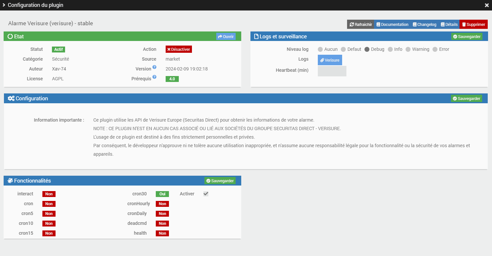
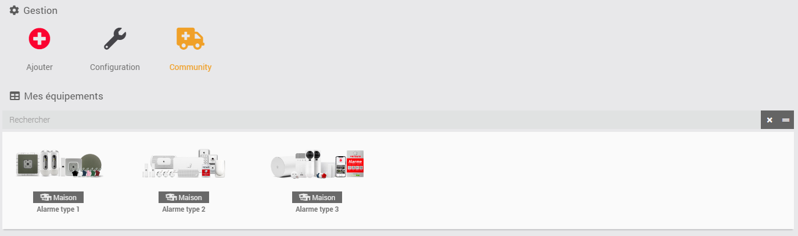
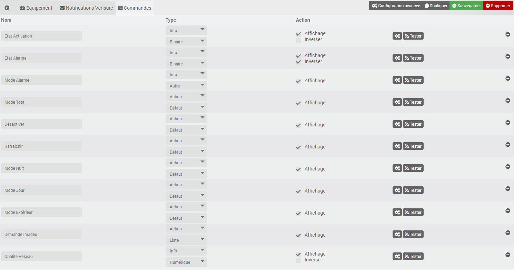
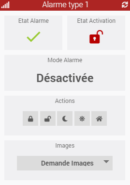
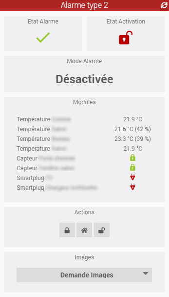

# Présentation 

Ce plugin Jeedom vous permet d'interagir avec votre alarme Verisure Europe (Securitas Direct) au même titre que l'application officielle "My Verisure".
Il est compatible avec 2 générations de matériels Verisure :

**NOTE : CE PLUGIN N'EST EN AUCUN CAS ASSOCIÉ OU LIÉ AUX SOCIÉTÉS DU GROUPE SECURITAS DIRECT - VERISURE.**

L'usage de ce plugin est destiné à des fins strictement personnelles et privées.
Par conséquent, le développeur n'approuve ni ne tolère aucune utilisation inappropriée, et n'assume aucune responsabilité légale pour la fonctionnalité ou la sécurité de vos alarmes et appareils.

# Principe 

Ce plugin interagit avec les API Verisure au travers du cloud, par conséquent **ce plugin nécessite une connexion Internet**.
 
Il faut également détenir un abonnement aux services Verisure. En effet, ce plugin ne dialogue avec la base de votre alarme qu'au travers de leurs infrastructures cloud. Il n'interagit pas directement avec la base, ni avec les smartplugs associés. Si votre abonnement a été résilié, ce plugin ne fonctionnera pas.

# Configuration du plugin

Après téléchargement du plugin, il vous suffit juste d’activer celui-ci, il n’y a aucune configuration supplémentaire à ce niveau.

> **Tip**
>
> Pour faciliter une demande d'aide à distance, il est conseillé de régler les logs en **mode debug**. 

# Ajout d'une alarme

La configuration des équipements Alarme est accessible à partir du menu Plugin > Sécurité.

Cliquez sur la commande Ajouter pour créer une nouvelle alarme. Une fois ajoutée vous vous retrouvez avec :

-   **Nom de l’équipement** : nom de votre alarme

-   **Objet parent** : indique l’objet parent auquel appartient l’équipement

-   **Catégorie** : la catégorie de l’équipement (sécurité en général pour une alarme)

-   **Activer** : permet de rendre votre équipement actif

-   **Visible** : rend votre équipement visible sur le dashboard

-   **Numéro d'installation** (alarme type 1) : indiquez votre numéro d'installation Vérisure

-   **Identifiant** (alarme type 1 & 2) : indiquez votre identifiant Verisure que vous utilisez pour vous connecter sur le site [https://customers.securitasdirect.fr](https://customers.securitasdirect.fr) ou [https://mypages.verisure.com/](https://mypages.verisure.com)

-   **Mot de passe** (alarme type 1 & 2) : indiquez votre mot de passe

-   **Code Alarme** (alarme type 2) : indiquez le code PIN de votre alarme (4 ou 6 digits)

-   **Pays** (alarme type 1): choisissez le pays dans lequel est installée votre alarme (pays supportés à ce jour : France, Espagne, Grande Bretagne, Italie, Portugal). Pour les alarmes type 2, la sélection du pays est automatique (pays supportés à ce jour : Belgique, Pays-Bas, Allemagne, Grande Bretagne, Danemark, Finlande, Norvège, Suède)

Il vous suffit ensuite de cliquer sur le bouton **Synchroniser** pour récupérer les informations de votre alarme. Si tout se passe bien, vous obtiendrez un tableau reprenant l'ensemble des smartplugs installés à votre domicile (ID, nom et type).

> **Tip**
>
> N'oubliez pas de **sauvegarder** vos informations !
>
> Lors de la sauvegarde, de nouvelles commandes vont se créer sur l'équipement.

# Journal d'activité

Vous avez la possibilité de consulter le journal d'activité de votre alarme en cliquant sur le bouton **Journal d'activité**. Ce rapport reprend les derniers évènements survenus sur votre centrale (alertes intrusion, SOS, activation / désactivation, coupure d'électricité).

# Notifications Verisure

Les API Verisure ne permettent pas les remontées d'informations et notifications automatiques directes, telles que l'activation/désactivation depuis un badge ou une télécommande ou encore le déclenchement de l'alarme.

Cet onglet décrit en détail comment paramétrer Jeedom (scénarios) pour palier à ce manque pour :
-   les **notifications Mail** pour l'activation/désactivation de l'alarme au travers du plugin [Mail Listener](https://www.jeedom.com/market/index.php?v=d&p=market&author=Lunarok&&name=maillistener) de Lunarok !
-   les **notifications SMS** pour la détection d'intrusion (dev en cours)

# Commandes

Il existe actuellement plusieurs commandes qui sont décrites ci-dessous.

## Info

-   **Etat Activation** : permet de connaitre l'état d'activation de l'alarme
	- **0** : désarmée
	- **1** : armée

-   **Etat Alarme** : permet de connaitre l'état de l'alarme
	- **0** : état normal
	- **1** : alarme déclenchée

-   **Mode Alarme** : permet de connaitre le mode d'activation de l'alarme
	- **Mode total** : l'alarme est activée en mode total (alarme type 1 & 2)
	- **Mode nuit** : l'alarme est activée en mode nuit (alarme type 1)
	- **Mode jour** : l'alarme est activée en mode jour (alarme type 1)
	- **Mode extérieur** : l'alarme est activée en mode extérieur (alarme type 1)
	- **Mode partiel** : l'alarme est activée en mode partiel (alarme type 2)

**Attention** : dans cette version, l'évènement lié au déclenchement de l'alarme n'est pas encore pris en compte !

## Action

-   **Mode Total** : active l'alarme en mode total (alarme type 1 & 2)

-   **Mode Nuit** : active l'alarme en mode nuit (alarme type 1)

-   **Mode Jour** : active l'alarme en mode jour (alarme type 1)

-   **Mode Extérieur** : active l'alarme en mode extérieur (alarme type 1)

-   **Mode Partiel** : active l'alarme en mode partiel (alarme type 2)

-   **Désactivation** : désactive de l'alarme, quel que soit le mode (alarme type 1 & 2)

-   **Rafraichir** : met à jour du statut de l'Alarme (alarme type 1 & 2)

-   **Demande Images** : déclenche la prise d'une photo depuis un détecteur de mouvement compatible et l'affiche à l'écran (alarme type 1 uniquement pour le moment)

> **Tip**
>
> Lors d'une demande d'image, la photo est enregistrée et stockée dans le répertoire **/verisure/data/**. Pensez à vider le répertoire de temps à temps ! 

## Compatibilité Homebridge

Les commandes ont été créées de manière à être compatibles nativement avec le plugin [Homebridge](https://www.jeedom.com/market/index.php?v=d&p=market&author=Nebz&&name=Homebridge) de Nebz ! (Merci à lui pour son aide)

Il n'y a donc aucune configuration spécifique à effectuer dans le plugin Homebridge.
Dans HomeKit, la fonction alarme est gérée suivant 4 modes : “Désactivée”, “Nuit”, “A distance” et “Domicile”.

La correspondance des modes est la suivante :
-   **Domicile** 	--> Mode Jour / Mode Partiel
-   **A distance**	--> Mode Total
-   **Nuit** 		--> Mode Nuit
-   **Désactivée**	--> Désactivation

Les autres modes (Extérieur,...) ne sont pas pris en compte dans HomeKit.

# Dashboard

Le plugin inclut un dashboard qui permet de :
-   Connaitre le statut de l'alarme (alarme type 1 & 2)
-   Connaitre l'état de l'alarme (alarme type 1 & 2)
-   Connaitre le mode e l'alarme (alarme type 1 & 2)
-   Activer le mode total de l'alarme (alarme type 1 & 2)
-   Activer le mode nuit de l'alarme (alarme type 1)
-   Activer le mode jour de l'alarme (alarme type 1)
-   Activer le mode extérieur de l'alarme (alarme type 1)
-   Activer le mode partiel de l'alarme (alarme type 2)
-   Désactiver l'alarme (alarme type 1 & 2)
-   Rafraichir le statut de l'alarme (alarme type 1 & 2)
-   Demander la prise d'une photo depuis un capteur de mouvement compatible (alarme type 1 uniquement pour le moment)
-   Afficher les informations de certains smartplugs comme la température, ou l'état d'ouverture (!!! UNIQUEMENT alarme type 2 !!!)

**Attention** : les commandes peuvent parfois mettre plusieurs secondes à se réaliser (entre 15s et 25s, voire plus d'une minute pour les demandes de photos). Cela est lié à la qualité de connexion 3G ou 4G de la base de votre alarme. Alors soyez patient !

# Rafraichissement

## Automatique

Un CRON est automatiquement créé sur base de 30 min comme indiqué dans la configuration du plugin.

**Attention** : cette valeur de 30 min pourra être amenée à évoluer en fonction du retour et des demandes des utilisateurs ainsi que du nombre de requêtes autorisées par heure par Verisure sur leurs serveurs !

## Manuel

Vous pouvez à tout moment utiliser la commande **Rafraichir** afin de rafraichir le statut de l'alarme.

# Roadmap

Ce plugin évoluera au fil du temps en fonction de vos demandes et des possibilités des API Versiure.

Les prochaines versions verront arriver les features suivantes :

-   Gestion du déclenchement de l'alarme (sur utilisation de reception d'un SMS ?)

> **Tip**
>
>Vous pouvez faire votre demande par en créant une demande "enhancement" [GitHub](https://github.com/Xav-74/verisure/issues/new).
>
>N'hésitez pas non plus à venir échanger sur ce plugin sur le forum Jeedom !